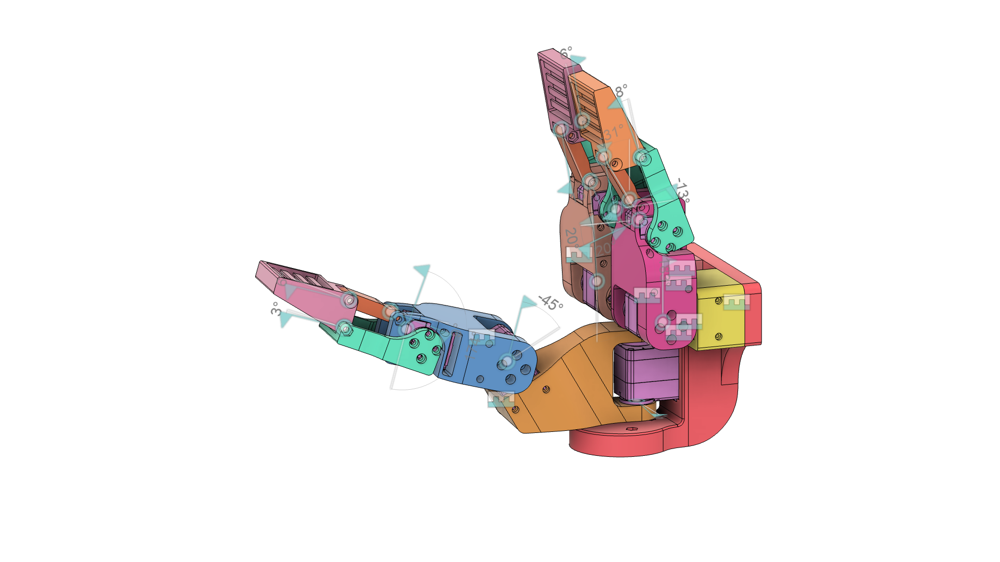

# Hand — Robot Description



## Overview

| Property | Value |
|----------|-------|
| Total mass | 4.292 kg |
| Links | 23 |
| Joints | 22 (13 movable) |
| Assemblies | 1 |
| Root link | `base_link` |

## Table of Contents

- [Kinematic Tree](#kinematic-tree)
- [Link Properties](#link-properties)
- [Joint Properties](#joint-properties)
- [Assembly Breakdown](#assembly-breakdown)
- [Quick Start (ROS 2)](#quick-start-ros-2)
- [Files](#files)

## Kinematic Tree

```
base_link
  └─ Rigid_1 [fixed]
    MOTOR_BASE_HOLDER_1
      └─ Rigid_3 [fixed]
        Hand_ST3215_Servo
          └─ Revolute_15 [revolute]
            MOTOR_SECOND_JOINT_HOLDER [BAKE]
              └─ Rigid_10 [fixed]
                Hand_ST3215_Servo_5
                  └─ Revolute_18 [revolute]
                    Hand_BACK_PUSHER [BAKE]
              └─ Revolute_19 [continuous]
                Hand_LINKAGE [BAKE]
                  └─ revolute_1 [continuous]
                    Hand_FINGERTIP_1 [BAKE]
  └─ Rigid_2 [fixed]
    MOTOR_BASE_HOLDER_2
      └─ Rigid_4 [fixed]
        Hand_ST3215_Servo_2
          └─ Revolute_17 [revolute]
            MOTOR_FIRST_JOINT_HOLDER [BAKE]
              └─ Rigid_11 [fixed]
                Hand_ST3215_Servo_6
                  └─ Revolute_26 [revolute]
                    Hand_BACK_PUSHER_3 [BAKE]
              └─ Revolute_27 [continuous]
                Hand_LINKAGE_3 [BAKE]
                  └─ Revolute [continuous]
                    FINGERTIP_2 [BAKE]
  └─ Rigid_5 [fixed]
    Hand_ST3215_Servo_3
      └─ Revolute_6 [revolute]
        MOTOR_BASE_HOLDER_THUMB [BAKE]
          └─ Rigid_9 [fixed]
            Hand_ST3215_Servo_4
              └─ Revolute_14 [revolute]
                MOTOR_THUMB_JOINT_HOLDER [BAKE]
                  └─ Rigid_13 [fixed]
                    Hand_ST3215_Servo_7
                      └─ Revolute_22 [revolute]
                        Hand_BACK_PUSHER_2 [BAKE]
                  └─ Revolute_23 [continuous]
                    Hand_LINKAGE_2 [BAKE]
                      └─ revolute [continuous]
                        Hand_FINGERTIP_1_2 [BAKE]
```

## Link Properties

| Link | Mass (kg) | Material | Collision | Bodies |
|------|-----------|----------|-----------|--------|
| `FINGERTIP_2` | 0.1789 | Steel | box | 1 |
| `Hand_BACK_PUSHER` | 0.0902 | Steel | box | 1 |
| `Hand_BACK_PUSHER_2` | 0.0902 | Steel | box | 1 |
| `Hand_BACK_PUSHER_3` | 0.0902 | Steel | box | 1 |
| `Hand_FINGERTIP_1` | 0.1789 | Steel | box | 1 |
| `Hand_FINGERTIP_1_2` | 0.1789 | Steel | box | 1 |
| `Hand_LINKAGE` | 0.0289 | Steel | cylinder | 1 |
| `Hand_LINKAGE_2` | 0.0289 | Steel | cylinder | 1 |
| `Hand_LINKAGE_3` | 0.0289 | Steel | cylinder | 1 |
| `Hand_ST3215_Servo` | 0.0557 | PPS | box | 1 |
| `Hand_ST3215_Servo_2` | 0.0557 | PPS | box | 1 |
| `Hand_ST3215_Servo_3` | 0.0557 | PPS | box | 1 |
| `Hand_ST3215_Servo_4` | 0.0557 | PPS | box | 1 |
| `Hand_ST3215_Servo_5` | 0.0557 | PPS | box | 1 |
| `Hand_ST3215_Servo_6` | 0.0557 | PPS | box | 1 |
| `Hand_ST3215_Servo_7` | 0.0557 | PPS | box | 1 |
| `MOTOR_BASE_HOLDER_1` | 0.2249 | Steel | box | 1 |
| `MOTOR_BASE_HOLDER_2` | 0.2249 | Steel | box | 1 |
| `MOTOR_BASE_HOLDER_THUMB` | 0.5937 | Steel | box | 1 |
| `MOTOR_FIRST_JOINT_HOLDER` | 0.2850 | Steel | box | 1 |
| `MOTOR_SECOND_JOINT_HOLDER` | 0.2770 | Steel | box | 1 |
| `MOTOR_THUMB_JOINT_HOLDER` | 0.3889 | Steel | box | 1 |
| `base_link` | 1.0138 | Steel | cylinder | 1 |

## Joint Properties

| Joint | Type | Parent → Child | Axis | Limits |
|-------|------|---------------|------|--------|
| `Revolute` | continuous | `Hand_LINKAGE_3` → `FINGERTIP_2` | (-0,-1,-0) | — |
| `Revolute_14` | revolute | `Hand_ST3215_Servo_4` → `MOTOR_THUMB_JOINT_HOLDER` | (0,1,0) | [-90.0°, 90.0°] |
| `Revolute_15` | revolute | `Hand_ST3215_Servo` → `MOTOR_SECOND_JOINT_HOLDER` | (0,1,-0) | [170.0°, 300.0°] |
| `Revolute_17` | revolute | `Hand_ST3215_Servo_2` → `MOTOR_FIRST_JOINT_HOLDER` | (-0,-1,0) | [-120.0°, 10.0°] |
| `Revolute_18` | revolute | `Hand_ST3215_Servo_5` → `Hand_BACK_PUSHER` | (0,-1,0) | [-105.0°, 10.0°] |
| `Revolute_19` | continuous | `MOTOR_SECOND_JOINT_HOLDER` → `Hand_LINKAGE` | (0,-1,0) | — |
| `Revolute_22` | revolute | `Hand_ST3215_Servo_7` → `Hand_BACK_PUSHER_2` | (0,-1,-0) | [85.0°, 190.0°] |
| `Revolute_23` | continuous | `MOTOR_THUMB_JOINT_HOLDER` → `Hand_LINKAGE_2` | (-0,1,-0) | — |
| `Revolute_26` | revolute | `Hand_ST3215_Servo_6` → `Hand_BACK_PUSHER_3` | (-0,1,0) | [-10.0°, 95.0°] |
| `Revolute_27` | continuous | `MOTOR_FIRST_JOINT_HOLDER` → `Hand_LINKAGE_3` | (-0,1,-0) | — |
| `Revolute_6` | revolute | `Hand_ST3215_Servo_3` → `MOTOR_BASE_HOLDER_THUMB` | (-1,-0,-1) | [-90.0°, 90.0°] |
| `Rigid_1` | fixed | `base_link` → `MOTOR_BASE_HOLDER_1` | (0,0,1) | — |
| `Rigid_10` | fixed | `MOTOR_SECOND_JOINT_HOLDER` → `Hand_ST3215_Servo_5` | (0,0,1) | — |
| `Rigid_11` | fixed | `MOTOR_FIRST_JOINT_HOLDER` → `Hand_ST3215_Servo_6` | (0,0,1) | — |
| `Rigid_13` | fixed | `MOTOR_THUMB_JOINT_HOLDER` → `Hand_ST3215_Servo_7` | (0,0,1) | — |
| `Rigid_2` | fixed | `base_link` → `MOTOR_BASE_HOLDER_2` | (0,0,1) | — |
| `Rigid_3` | fixed | `MOTOR_BASE_HOLDER_1` → `Hand_ST3215_Servo` | (0,0,1) | — |
| `Rigid_4` | fixed | `MOTOR_BASE_HOLDER_2` → `Hand_ST3215_Servo_2` | (0,0,1) | — |
| `Rigid_5` | fixed | `base_link` → `Hand_ST3215_Servo_3` | (0,0,1) | — |
| `Rigid_9` | fixed | `MOTOR_BASE_HOLDER_THUMB` → `Hand_ST3215_Servo_4` | (0,0,1) | — |
| `revolute` | continuous | `Hand_LINKAGE_2` → `Hand_FINGERTIP_1_2` | (0,1,-0) | — |
| `revolute_1` | continuous | `Hand_LINKAGE` → `Hand_FINGERTIP_1` | (0,1,0) | — |

## Assembly Breakdown

### Hand

- **Links**: base_link, MOTOR_BASE_HOLDER_1, MOTOR_BASE_HOLDER_2, Hand_ST3215_Servo, Hand_ST3215_Servo_2, Hand_ST3215_Servo_3, MOTOR_BASE_HOLDER_THUMB, MOTOR_FIRST_JOINT_HOLDER, MOTOR_SECOND_JOINT_HOLDER, Hand_ST3215_Servo_4, Hand_ST3215_Servo_5, Hand_ST3215_Servo_6, MOTOR_THUMB_JOINT_HOLDER, Hand_ST3215_Servo_7, Hand_LINKAGE, Hand_FINGERTIP_1, Hand_BACK_PUSHER, Hand_LINKAGE_2, Hand_FINGERTIP_1_2, Hand_BACK_PUSHER_2, Hand_LINKAGE_3, Hand_BACK_PUSHER_3, FINGERTIP_2
- **Total mass**: 4.292 kg

## Quick Start (ROS 2)

```bash
# 1. Copy package to your ROS 2 workspace
cp -r Hand_description ~/ros2_ws/src/

# 2. Build
cd ~/ros2_ws
colcon build --packages-select Hand_description
source install/setup.bash

# 3. Visualize in RViz2
ros2 launch Hand_description display.launch.py

# 4. Validate URDF structure
check_urdf install/Hand_description/share/Hand_description/urdf/Hand.urdf

# 5. Print kinematic tree
urdf_to_graphviz install/Hand_description/share/Hand_description/urdf/Hand.urdf
```

**Joint control**: The launch file includes `joint_state_publisher_gui` —
use the sliders to move revolute/prismatic joints in RViz2.

**Topic inspection**:
```bash
# See published joint states
ros2 topic echo /joint_states

# See robot description parameter
ros2 param get /robot_state_publisher robot_description
```

## Files

| Path | Description |
|------|-------------|
| `urdf/Hand.urdf.xacro` | Top-level xacro (entry point) |
| `urdf/Hand.urdf` | Flat URDF (for validation) |
| `urdf/assemblies/` | Per-assembly xacro macros |
| `meshes/` | Visual (OBJ) and collision (STL) meshes |
| `launch/display.launch.py` | Launch robot_state_publisher, RViz, and generated controllers |
| `config/joint_state.yaml` | Joint state publisher config |
| `config/ros2_controllers.yaml` | Generated ros2_control controller manager config |
| `robot_data.yaml` | Supplementary data (beyond URDF) |
| `docs/transforms.md` | Transformation matrices (KaTeX) |

## Customizing

Assemblies tagged `!dummy_` are designed to be swapped out. To replace one:

1. Create your replacement as a xacro macro with the same interface
2. Place it in `urdf/assemblies/`
3. Update the `<xacro:include>` in `urdf/Hand.urdf.xacro`
4. Update meshes in `meshes/<your_assembly>/`

The xacro prefix system (`${prefix}`) ensures link names stay unique
when multiple instances of the same assembly are used.

---
*Generated by Fusion URDF/XACRO Exporter v3.0.0*